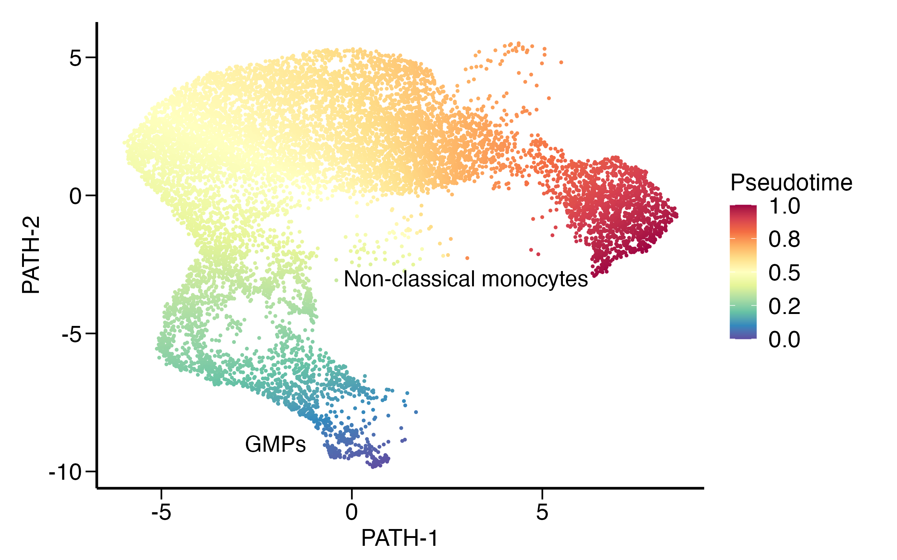

This tutorial offers an illustrative analysis of the human monocytes data from [Oetjen et al., 2018](https://insight.jci.org/articles/view/124928) using MeDuSA. Prior to running the analysis, it is important to ensure that the MeDuSA package has been installed. For installation instructions, please refer to the following [link](https://github.com/LeonSong1995/MeDuSA).


## Input data
`MeDuSA` requires two types of input data:
- Bulk RNA-seq data. 
- Single cell RNA-seq (scRNA-seq) data, which should be provided in the form of a Seurat object that includes the annotated cell-state trajectory and cell types. 

For how to prepare the cell-state trajectory data, please read the section of `Prepare reference data` in this tutorial. 

The input data required for running this tutorial can be downloaded from the following [link](https://github.com/LeonSong1995/MeDuSA). 
Detailed information regarding the input data is provided as follows.

### 1. Bulk RNA-seq data
```r
#### load the example bulk RNA-seq data, 
bulk = readRDS("../Monocytes_bulk.rds")
class(bulk)
"matrix" "array" 
```
The bulk RNA-seq data is represented in a matrix format, where each row corresponds to a specific gene and each column corresponds to a particular sample.

### 2. Reference scRNA-seq data
```r
#### load the example scRNA-seq data, 
sce = readRDS("./Monocytes_sce.rds")
class(sce)
[1] "Seurat"
attr(,"package")
[1] "SeuratObject"

sce@assays$RNA@counts[1:3,1:3]
              A/A.rds_AAACCTGCAGCGAACA-1 A/A.rds_AAACCTGGTCGACTGC-1 A/A.rds_AAACCTGGTCGCTTCT-1
FO538757.2                             .                          .                          .
AP006222.2                             .                          .                          .
RP4-669L17.10                          .                          .                          .

sce$cell_trajectory[1:3]
A/A.rds_AAACCTGCAGCGAACA-1 A/A.rds_AAACCTGGTCGACTGC-1 A/A.rds_AAACCTGGTCGCTTCT-1 
                 0.9220488                  0.5167408                  0.4567616 
		 
sce$cell_type[1:3]
A/A.rds_AAACCTGCAGCGAACA-1 A/A.rds_AAACCTGGTCGACTGC-1 A/A.rds_AAACCTGGTCGCTTCT-1 
                     "mon"                      "mon"                      "mon" 
```
For compatibility with MeDuSA, the reference scRNA-seq data must be in the Seurat object format. Specifically, the reference data should be stored in `sce@assays$RNA@counts`, the cell-state trajectory in `sce$cell_trajectory`, and the cell-type in `sce$cell_type`. For more information about Seurat, please refer to the following [resource](https://satijalab.org/seurat/).


## Cell-state deconvolution analysis
```r
library(MeDuSA)

#Documentations
help(MeDuSA)
``` 
### 1. Basic usage of MeDuSA
This section provides an introduction to the basic usage of MeDuSA.
- bulk: A matrix of bulk RNA-seq data. 
- sce: A Seurat object of scRNA-seq data.  
- select.ct: A character variable indicating the focal cell type.
- markerGene: A character vector containing the marker genes across the cell-state trajectory.If not provided, MeDuSA will utilize the `MeDuSA_marker` function to select marker genes for the analysis.
- resolution: A numeric variable used to specify the number of cell-state bins along the cell trajectory.
- smooth: A boolean variable to determine whether to smooth the estimated cell-state abundance.
- span: A numeric variable to control the degree of smoothing.
- fractional: A boolean variable to determine whether to normalize the estimated cell-state abundance to the fractional abundance (0-1).
- ncpu: The number of CPU cores to be used. 

For further details about the parameters, please refer to this [link](https://github.com/LeonSong1995/MeDuSA).
```r
MeDuSA_obj = MeDuSA(bulk,sce,
                  select.ct = 'mon',markerGene = NULL,span = 0.35,
		  resolution = 50,smooth = TRUE,fractional = TRUE,ncpu = 4)		 
```
The results are stored in MeDuSA_obj@Estimation.
- The estimated cell-state abundance: MeDuSA_obj@Estimation$cell_state_abundance
- The median state (pseudo-time) of cell-state bins: MeDuSA_obj@Estimation$TimeBin
- The used marker genes: MeDuSA_obj@Estimation$markerGene


### 2. How to select marker genes
MeDuSA offers users the flexibility to input their own cultivated marker genes. In addition, MeDuSA provides two methods for selecting marker genes that are representative of the cell-state trajectory.

- wilcox test: MeDuSA divides the cells in the trajectory into a specified number of bins and applies the wilcox test, which is implemented in the `Seurat::FindMarkers` function, to each bin. The wilcox test is used to compare gene expression levels between the cells in the current bin and all other cells in the trajectory. Genes with significant differential expression are identified as marker genes for that particular bin. By performing the wilcox test for each gene at every bin along the cell-state trajectory, MeduSA can identify marker genes that are specific to each stage of the trajectory.

- gam-wald test: MeduSA uses the generalized additive model (gam) to associate genes along the cell-state trajectory, and considers only genes with an FDR-adjusted p-value less than 0.01. These significant genes are ranked based on their association strength, allowing for the identification of the most relevant genes that are associated with the cell-state trajectory. To prevent certain cell-states from being overrepresented, MeduSA divides the cell-state trajectory into a specified number of intervals and assigns each gene to the interval in which it has the highest mean expression. For each interval, a set of top informative genes is selected as signature genes.

Users can specify the `method` in the `MeDuSA` function as either `wilcox` or `gam` to utilize these two methods. Alternatively, users can select the marker genes using the `MeDuSA_marker` function before running the deconvolution analysis. 

```r
##Set the gene selection method in MeDuSA function 
library(MeDuSA)
#wilcox
MeDuSA_obj = MeDuSA(bulk,sce,
		    select.ct = 'mon',markerGene = NULL,span = 0.35,method = "wilcox",
		    resolution = 50,smooth = TRUE,fractional = TRUE,ncpu = 4)	
#gam-wald
MeDuSA_obj = MeDuSA(bulk,sce,
		    select.ct = 'mon',markerGene = NULL,span = 0.35,method = "gam",
		    resolution = 50,smooth = TRUE,fractional = TRUE,ncpu = 4)
		    
##Select marker genes using MeDuSA_marker before running deconvolution analysis
marker = MeDuSA_marker(sce[,which(sce$cell_type=='mon')],bulk,
                               GeneNumber = 200,nbins = 10,
                               family ="gaussian",k = 10,ncpu = 4,method = "wilcox")
##Documentations			       
help(MeDuSA_marker)			       
```
### 3. How to include other cell types as covariates
To address the possibility of confounding factors arising from other cell types, MeDuSA allows (suggests) that users include these cell types as covariates. MeDuSA provides two ways to incorporate the other cell types in the model. 

We recommend that users build the covariates matrix before running the deconvolution analysis, as this can help to save memory during the analysis. 

```r
#1.1 load the data
sce_otherCT = readRDS("../Monocytes_OtherCell.rds")
cov_otherCT = Seurat::AverageExpression(object = sce_otherCT,group.by = 'cell_type',assays ='RNA',slot='counts')$RNA
remove(sce_otherCT)

#1.2 To input the covariates matrix into MeDuSA, users can specify the parameter of fixCov. 
MeDuSA_obj = MeDuSA(bulk,sce,fixCov = cov_otherCT,
		    select.ct = 'mon',markerGene = NULL,span = 0.35,method = "wilcox",
		    resolution = 50,smooth = TRUE,fractional = TRUE,ncpu = 4)	
```

Alternatively, users can also choose to merge the data of the focal cell-type and other cell-types into a single Seurat object.

```r
#2.1 load the data
sce_otherCT = readRDS("../Monocytes_OtherCell.rds")
sce_big = merge(sce,sce_otherCT)
cell_type = c(sce$cell_type,sce_otherCT$cell_type)
sce_big$cell_type = cell_type[colnames(sce_big)]
remove(sce_otherCT); remove(sce)

#2.2 MeDuSA will automatically construct the covariates matrix based on the cell-type labels stored in sce_big$cell_type.
MeDuSA_obj = MeDuSA(bulk,sce = sce_big,
		    select.ct = 'mon',markerGene = NULL,span = 0.35,method = "wilcox",
		    resolution = 50,smooth = TRUE,fractional = TRUE,ncpu = 4)	
```

### 4. How to use the mode of conditional autoregressive (CAR)
In many LMM applications, random effects are assumed to be independent and identically distributed. However, the abundances of cells at adjacent states are likely to be correlated. MeDuSA incorporates the CAR model in the LMM to accommodate such correlations. Users can set the parameter of `CAR` as TRUE to use the CAR mode. Further, MeDuSA provides users with the ability to set the range of possible correlation strengths through the `phi` parameter.  Based on this range, MeDuSA then automatically searches for the optimal correlation strength that maximizes the likelihood function. 
```R
#The default phi is c(0.2,0.4,0.6,0.9)
MeDuSA_obj = MeDuSA(bulk,sce, CAR = TRUE,
                   select.ct = 'mon',markerGene = NULL,span = 0.35,
		   resolution = 50,smooth = TRUE,fractional = TRUE,ncpu = 4)	

#Change the parameter space of phi
phi = c(0,0.1,0.99)
MeDuSA_obj = MeDuSA(bulk,sce, CAR = TRUE, phi = phi,
                   select.ct = 'mon',markerGene = NULL,span = 0.35,
		   resolution = 50,smooth = TRUE,fractional = TRUE,ncpu = 4)	
``` 
It is important to note that when using the CAR mode, the computational speed can become slow. This is primarily due to the computational burden of inverting the covariance matrix between cells, which can become especially significant when using large reference datasets.

### 5. How to normalize the data 
Before running the deconvolution analysis, we recommend that users normalize the reference data and the bulk data to the same scale. It is important to note that MeDuSA <big>does not</big> perform any normalization for the input reference and bulk data due to the variety in data scale, which may include raw counts, counts per million (CPM), transcripts per million (TPM), fragments per kilobase of transcript per million (FPKM), or log-transformed data.  While MeDuSA is generally robust to different scales, the heterogeneity in data scale between the bulk and reference data may negatively impact the performance. Therefore, users must carefully check and perform the appropriate normalization of their data before running MeDuSA to ensure accurate and reliable results. For example, in this tutorial, we have normalized the data into CPM scale.
```r
###To prevent exceeding the largest upper limit in R during REML iteration, we normalized the data to 1e+3 instead of 1e+6. 
bulk = sweep(bulk,2,colSums(bulk),'/')*1000
sce@assays$RNA@counts = sweep(sce@assays$RNA@counts,2,colSums(sce@assays$RNA@counts),'/')*1000
```
Users can try normalizing data to other scales as well, such as the count or log-transformed scale. 

### 6. How to get the p-value of the random effects component
After completing the deconvolution analysis using MeDuSA, users can utilize the MeDuSA_VarExplain function to obtain the explained variance of the bulk data by the reference scRNA-seq data, as well as the corresponding p-values.
```R
MeDuSA_obj = MeDuSA_VarExplain(MeDuSA_obj)
```
The results is stored in `MeDuSA_obj@VarianceExplain`. 


## Prepare reference data
It is important to note that in real-world applications, users should annotate the cell-state trajectory based on their own data and research interests. There are many methods to infer the cell trajectory in scRNA-seq data, such as: 

- [Slingshot](https://bioconductor.org/packages/devel/bioc/vignettes/slingshot/inst/doc/vignette.html)
- [CytoTRACE](https://cytotrace.stanford.edu/)
- [Monocle3](https://cole-trapnell-lab.github.io/monocle3/)
- [scVelo](https://github.com/theislab/scvelo)

In this section, we will walk through the steps involved in preparing the reference scRNA-seq data used in this tutorial, starting with the raw count data generated by [CellRanger](https://support.10xgenomics.com/single-cell-gene-expression/software/pipelines/latest/what-is-cell-ranger).

### 1. Download the raw scRNA-seq data 
We will download the raw data from the GEO database and subsequently rename them based on their respective sample names
```bash
#!/bin/bash
##1) download the data from the GEO database
mkdir JCI
cd JCI
wget https://ftp.ncbi.nlm.nih.gov/geo/series/GSE120nnn/GSE120221/suppl/GSE120221_RAW.tar
tar -xvf GSE120221_RAW.tar

##2) rename the data based on sample id 
ls *mtx.gz | while read file
do
  id=$(echo $file | cut -d "_" -f 3 | cut -d "." -f 1)
  mkdir `pwd`/${id}
  mv *barcodes_${id}.tsv.gz `pwd`/${id}/barcodes.tsv.gz 
  mv *genes_${id}.tsv.gz `pwd`/${id}/features.tsv.gz 
  mv *matrix_${id}.mtx.gz `pwd`/${id}/matrix.mtx.gz 
done
```
### 2. Process the raw scRNA-seq data 
We will use [DoubletFinder](https://github.com/chris-mcginnis-ucsf/DoubletFinder) to detect possible doublets in each scRNA-seq data. After filtering out the identified doublets, the data will be merged into a single Seurat object.

```R
library(Seurat)
library(DoubletFinder)

##1) read the data and do quality control
setwd("../JCI")
file = list.files()
for(id in file){
	print(id)
	#read the data
	path = paste0("../JCI/",id)
	data = Read10X(data.dir = path)
	data = CreateSeuratObject(counts = data,min.cells = 3, min.features = 200)
	data[["percent.mt"]] = PercentageFeatureSet(data, pattern = "^MT-")
	
	#standard process
	data = NormalizeData(data)
	data = FindVariableFeatures(data, selection.method = "vst", nfeatures = 2000)
	data = ScaleData(data)
	data = RunPCA(data)
	data = RunUMAP(data, dims = 1:15)
	data = FindNeighbors(data, reduction = "pca", dims = 1:15)
	data = FindClusters(data)
	
	#define the doublet rate (follow the possible doublet rate provided by 10x)
	ncell = ncol(data)
	if(ncell<500){dbrate = 0.4/100}
	if(ncell>=500 && ncell<1000){dbrate = 0.4/100}
	if(ncell>=1000 && ncell<2000){dbrate = 0.8/100}
	if(ncell>=2000 && ncell<3000){dbrate = 1.6/100}
	if(ncell>=3000 && ncell<4000){dbrate = 2.3/100}
	if(ncell>=4000 && ncell<5000){dbrate = 3.1/100}
	if(ncell>=5000 && ncell<6000){dbrate = 3.9/100}
	if(ncell>=6000 && ncell<7000){dbrate = 4.6/100}
	if(ncell>=7000 && ncell<8000){dbrate = 5.4/100}
	if(ncell>=8000 && ncell<9000){dbrate = 6.1/100}
	if(ncell>=9000 && ncell<10000){dbrate = 6.9/100}
	if(ncell>=10000){dbrate = 7.6/100}

	#remove doublet
	homotypic.prop = DoubletFinder::modelHomotypic(Idents(data))  
	nExp_poi = round(dbrate*ncell) 
	nExp_poi.adj = round(nExp_poi*(1-homotypic.prop))
	data = DoubletFinder::doubletFinder_v3(data, PCs = 1:10, pN = 0.25, pK = 0.09, nExp = nExp_poi, reuse.pANN = FALSE, sct = FALSE)
	
	#save the data
	out = paste(path,paste0(id,'.rds'),sep='/')
	saveRDS(data,out)		
}

##2) merge the data
setwd("../JCI")
file = list.files()
data = sapply(file,function(id){
  print(id)
  path = paste(id,paste0(id,'.rds'),sep='/')	
  dat = readRDS(path)
  db = c(table(dat@meta.data[,grep('DF',colnames(dat@meta.data))])[1])
  dat.qc = dat[,dat@meta.data[,grep('DF',colnames(dat@meta.data))]=='Singlet']
  dat.qc = dat.qc[,dat.qc$percent.mt<20]
  dat.qc = RenameCells(dat.qc,new.names=paste(path,colnames(dat.qc),sep='_'))
  dat.qc$sample = id
  dat.qc 
})
data.merge = Reduce(function(x, y) merge(x, y), data)
saveRDS(data.merge,'../Human_BoneMarrow_JCI_Insight.rds')
```
The merged scRNA-seq data can be obtained either by following the above pipeline or by downloading it directly from the following [link](https://github.com/LeonSong1995/MeDuSA).  

### 3. Annotate cell types
We will perform cell clustering and assign cell-types based on expression pattern of marker genes. To account for potential confounding factors during single-cell RNA sequencing, the black gene list, provided by [Xue et al.](https://www.nature.com/articles/s41586-022-05400-x) will be utilized. This list can be downloaded from the following [link](https://github.com/LeonSong1995/MeDuSA).

```R
library(Seurat)
library(DoubletFinder)
library(dplyr)
library(ggplot2)

BlackGene = read.csv('../Gene_BlackList.csv',fill=T)
BM = readRDS('../Human_BoneMarrow_JCI_Insight.rds')
BM$sample[which(BM$sample=='C1')]='C'

#construct the confounding score
mt_gene = intersect(unique(BlackGene[,'Mitochondria']),rownames(BM))
hsp_gene = intersect(unique(BlackGene[,'Heat.shock.protein']),rownames(BM))
rib_gene = intersect(unique(BlackGene[,'Ribosome']),rownames(BM))
disso_gene = intersect(unique(BlackGene[,'Dissociation']),rownames(BM))
noisy_gene = c(mt_gene,hsp_gene,rib_gene,disso_gene)
BM = AddModuleScore(BM,features=list(mt_gene),name = 'mt_score',nbin=10)
BM = AddModuleScore(BM,features=list(hsp_gene),name = 'hsp_score',nbin=10)
BM = AddModuleScore(BM,features=list(rib_gene),name = 'rib_score',nbin=10)
BM = AddModuleScore(BM,features=list(disso_gene),name = 'disso_score',nbin=10)

#regress out the confounding score
out = c('mt_score1','hsp_score1','rib_score1','disso_score1')
BM = BM[!rownames(BM) %in% noisy_gene,]
BM = NormalizeData(BM) %>% 
     FindVariableFeatures() %>% 
     ScaleData(vars.to.regress = out) %>% 
     RunPCA(verbose = FALSE) %>%
     RunUMAP(reduction = "pca", dims = 1:50) %>% 
     FindNeighbors(reduction = "pca", dims = 1:50) %>%
     FindClusters(resolution=2)

mk_gene = c('HBD','AVP','CD3E','CD3G','CD3D','CD79B','CD79A','NKG7','GATA1','SPI1','CD4','CD8A','FOXP3','CCR7','CD74','TMSB10')

#check the expression level of marker genes
figure.dim = DimPlot(BM,pt.size=0.05,label=T,label.size = 6,repel = TRUE)+ 
               theme(legend.position='none') +
               ggtitle(NULL) +
               xlab('UMAP-1')+ylab('UMAP-2')

p = FeaturePlot(BM,features = mk_gene,combine = FALSE)
for(i in 1:length(p)) {p[[i]] = p[[i]] + NoLegend() + NoAxes()}
figure.feature  = cowplot::plot_grid(plotlist = p,ncol = 4)

#annotate cell types
HSPC = c('21')
HSPCtoMon = c('22','23','26','30','1','16')
HSPCtoEry = c('32','25','19','14','31','17','42','15','37')
ct = as.vector(Idents(BM))
ct[ct %in% HSPC] = 'HSPC'
ct[ct %in% HSPCtoMon] = 'HSPCtoMon'
ct[ct %in% HSPCtoEry] = 'HSPCtoEry'
BM$ct = ct

#splict the data based on cell types and save the data. 
Mon = BM[,BM$ct %in% c('HSPC','HSPCtoMon')]
OtherCell = BM[,BM$ct %in% setdiff(cell_type_annotated,c('HSPC','HSPCtoMon'))]
saveRDS(Mon,'../Mon.rds')
saveRDS(OtherCell,'../OtherCell.rds')
```
For user convenience, we have provided the processed scRNA-seq data of monocytes in the following [link](https://github.com/LeonSong1995/MeDuSA).

### 4. Infer the cell-state trajectory 
In this tutorial analysis, we will use [Slingshot](https://bioconductor.org/packages/devel/bioc/vignettes/slingshot/inst/doc/vignette.html) to infer the development trajectory of monocytes. 

```R
library(Seurat)
library(dplyr)
library(slingshot)
library(ggplot2)

#load the data
Mon = readRDS('../Mon.rds')

#regress out the confounding factors and use the SCT transformation. 
confounding = c("mt_score1","hsp_score1","rib_score1","disso_score1","nCount_RNA","sample")
Mon = NormalizeData(Mon) %>%
      SCTransform(vars.to.regress = confounding,return.only.var.genes = T) %>%
      RunPCA(verbose = FALSE) %>%
      RunUMAP(Mon, reduction = "pca", dims = 1:15) %>%
      FindNeighbors(Mon, reduction = "pca", dims = 1:15)  %>%
      FindClusters(Mon,resolution = 2)
	
#remove clusters that are not connect to the main trajectory.    
sce = Mon[,!Idents(Mon) %in% c('18','12','27','2','25')]
FeaturePlot(Mon,features=c('CD34','FGL2'))
remove(Mon)

#annotate cell trajectory using the slingshot
umap = as.data.frame(Embeddings(sce,'umap'))
umap$ct = as.vector(Idents(Mon))
sds = getLineages(umap[,1:2], umap$ct, start.clus = '21')
sds = getCurves(sds)
path = as.data.frame(sds@metadata$curves$Lineage1$s)
pseudo_time = sds@metadata$curves$Lineage1$lambda
pseudo_time = pseudo_time/max(pseudo_time)

#add the cell-type and cell-state trajectory into the meta data. 
sce$cell_type = 'mon'
sce$cell_trajectory = pseudo_time[colnames(sce)]

##visualize the cell-state trajectory
colors = c("#9e0142", "#d53e4f", "#f46d43", "#fdae61", "#fee08b", "#ffffbf", "#e6f598", "#abdda4", "#66c2a5", "#3288bd", "#5e4fa2")
colors = colors[seq(length(colors),1,-1)]
p1 = ggplot(umap,aes(x=UMAP_1,y=UMAP_2))+
  geom_point(aes(col=time),size=0.5)+
  xlab('PATH-1')+
  ylab('PATH-2')+
  theme(legend.position = 'right',
        legend.justification = "left",
        panel.border = element_blank(), axis.line = element_line(size = 0.8))+
  annotate('text',x=-2,y=-9,label='GMPs',size=5)+
  annotate('text',x=3,y=-3,label='Non-classical monocytes',size=5)+
  scale_color_gradientn(colours = colors,name='Pseudotime',labels = scales::number_format(accuracy = 0.1))

print(p1)

#save the reference scRNA-seq data
saveRDS(sce,'../Monocytes_sce.rds')
```



