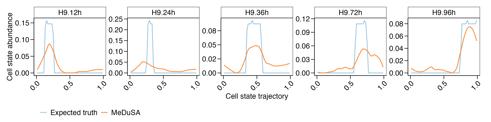

This tutorial provides an illustrative analysis of the hPSC dataset from [Chu et al.](https://genomebiology.biomedcentral.com/articles/10.1186/s13059-016-1033-x) using MeDuSA. 


In this tutorial, we will use a dataset obtained from the hPSC cell line, which was cultured for different durations, to estimate cell-state abundance along the hPSC differentiation trajectory in bulk RNA-seq data using MeDuSA. Furthermore, we will validate the performance of MeDuSA by comparing the estimated cell-state abundance with that measured from scRNA-seq data. Finally, we will employ the `MANOVA-Pro` method to identify any differences in cell-state abundance among the different cultured time points.

For a more comprehensive tutorial on using data from real tissue that consists of multiple cell types, please visit the following [link](https://leonsong1995.github.io/MeDuSA/documentation/04_Mon_Example.html). This tutorial provides a detailed discussion on several important aspects, including how to select marker genes, how to incorporate other cell types as covariates, how to use the mode of conditional autoregressive (CAR), and how to normalize data.

Prior to running the analysis, it is important to ensure that the MeDuSA package has been installed. For installation instructions, please refer to the following [link](https://github.com/LeonSong1995/MeDuSA).


## Input data
`MeDuSA` requires two types of input data:
- Bulk RNA-seq data. 
- Single cell RNA-seq (scRNA-seq) data, which should be provided in the form of a Seurat object that includes the annotated cell-state trajectory and cell types. 

For how to prepare the cell-state trajectory data, please read the section of `Prepare reference data` in this tutorial. 

The input data required for running this tutorial can be downloaded from the following [link](https://github.com/LeonSong1995/MeDuSA). 
Detailed information regarding the input data is provided as follows.

### 1. Bulk RNA-seq data
```r
#### load the example bulk RNA-seq data, 
bulk = readRDS("../hPSC_bulk.rds")
class(bulk)
"matrix" "array" 
```
The bulk RNA-seq data is represented in a matrix format, where each row corresponds to a specific gene and each column corresponds to a particular sample.

### 2. Reference scRNA-seq data
```r
#### load the example scRNA-seq data, 
sce = readRDS("./hPSC_sce.rds")
class(sce)
[1] "Seurat"
attr(,"package")
[1] "SeuratObject"

sce@assays$RNA@counts[1:3,1:3]
     H9.00hb4s_001 H9.00hb4s_002 H9.00hb4s_003
A1BG    0.003922580   .             0.001974782
A1CF    0.001407226   0.001114947   .          
A2LD1   .             .             .          

sce$cell_trajectory[1:3]
H9.00hb4s_001 H9.00hb4s_002 H9.00hb4s_003 
   0.09366755    0.02506596    0.02638522 
		 
sce$cell_type[1:3]
H9.00hb4s_001 H9.00hb4s_002 H9.00hb4s_003 
       "hPSC"        "hPSC"        "hPSC"
```
For compatibility with MeDuSA, the reference scRNA-seq data must be in the Seurat object format. Specifically, the reference data should be stored in `sce@assays$RNA@counts`, the cell-state trajectory in `sce$cell_trajectory`, and the cell-type in `sce$cell_type`. For more information about Seurat, please refer to the following [resource](https://satijalab.org/seurat/).


## Cell-state deconvolution analysis
```r
library(MeDuSA)

#Documentations
help(MeDuSA)
``` 
### 1. Basic usage of MeDuSA
This section provides an introduction to the basic usage of MeDuSA.
- bulk: A matrix of bulk RNA-seq data. 
- sce: A Seurat object of scRNA-seq data.  
- select.ct: A character variable indicating the focal cell type.
- markerGene: A character vector containing the marker genes across the cell-state trajectory.If not provided, MeDuSA will utilize the `MeDuSA_marker` function to select marker genes for the analysis.
- resolution: A numeric variable used to specify the number of cell-state bins along the cell trajectory.
- smooth: A boolean variable to determine whether to smooth the estimated cell-state abundance.
- span: A numeric variable to control the degree of smoothing.
- fractional: A boolean variable to determine whether to normalize the estimated cell-state abundance to the fractional abundance (0-1).
- ncpu: The number of CPU cores to be used. 

For further details about the parameters, please refer to this [link](https://github.com/LeonSong1995/MeDuSA).
```r
MeDuSA_obj = MeDuSA(bulk,sce,
                  select.ct = 'hPSC',markerGene = NULL,span = 0.35,
		  resolution = 50,smooth = TRUE,fractional = TRUE,ncpu = 4)		 
```
The results are stored in `MeDuSA_obj@Estimation`.
- The estimated cell-state abundance: `MeDuSA_obj@Estimation$cell_state_abundance`
- The median state (pseudo-time) of cell-state bins: `MeDuSA_obj@Estimation$TimeBin`
- The used marker genes: `MeDuSA_obj@Estimation$markerGene`

### 2. P values of the random effects component
After completing the deconvolution analysis using MeDuSA, users can utilize the MeDuSA_VarExplain function to obtain the explained variance of the bulk data by the reference scRNA-seq data, as well as the corresponding p-values.
```R
MeDuSA_obj = MeDuSA_VarExplain(MeDuSA_obj)
```
The results is stored in `MeDuSA_obj@VarianceExplain`. 


## Prepare reference data
It is important to note that in real-world applications, users should annotate the cell-state trajectory based on their own data and research interests. There are many methods to infer the cell trajectory in scRNA-seq data, such as: 

- [Slingshot](https://bioconductor.org/packages/devel/bioc/vignettes/slingshot/inst/doc/vignette.html)
- [CytoTRACE](https://cytotrace.stanford.edu/)
- [Monocle3](https://cole-trapnell-lab.github.io/monocle3/)
- [scVelo](https://github.com/theislab/scvelo)

In this tutorial, we will follow the pipeline provided by the author of the dataset and use [WaveCrest](https://genomebiology.biomedcentral.com/articles/10.1186/s13059-016-1033-x) to infer the differentiation trajectory of hPSCs.

### 1. Download the raw scRNA-seq data 
We will download the raw data from the GEO database. 
```bash
#the bulk RNA-seq data 
wget https://ftp.ncbi.nlm.nih.gov/geo/series/GSE75nnn/GSE75748/suppl/GSE75748_bulk_time_course_ec.csv.gz

#the scRNA-seq data
wget https://ftp.ncbi.nlm.nih.gov/geo/series/GSE75nnn/GSE75748/suppl/GSE75748_sc_time_course_ec.csv.gz
```
### 2. Process the raw scRNA-seq data 
```R
library(Seurat)
library(WaveCrest)
library(data.table)
library(ggplot2)

##1) read the data
sce = fread('/Users/songliyang/Documents/MeDuSA_new/revision/embry/GSE75748_sc_time_course_ec.csv.gz')
sce = as.data.frame(sce)
rownames(sce) = sce[,1];sce = sce[,-1]

##2) Infer the cell-state trajectory
size = MedianNorm(sce)
DataNorm = GetNormalizedMat(sce,size)
condition = sapply(colnames(sce),function(i){strsplit(i,split = '_')[[1]][1]})
#! Please note that running WaveCrestENI is a time-consuming process, and it took us 28 hours to complete the estimation.
pseudo_time = WaveCrestENI(GeneList = VariableFeatures(sce),N = 5, Data = DataNorm,Conditions = condition)

##3) Visualize the result
sce = CreateSeuratObject(DataNorm)
sce = NormalizeData(sce) %>%
      FindVariableFeatures(selection.method = "vst",nfeatures = 1000) %>%
      ScaleData() %>%
      RunPCA(verbose = FALSE)
space = as.data.frame(Embeddings(sce[['pca']]))
space$pseudo_time = pseudo_time[colnames(sce)]

colors = c("#9e0142", "#d53e4f", "#f46d43", "#fdae61", "#fee08b","#ffffbf", "#e6f598", "#abdda4", "#66c2a5", "#3288bd", "#5e4fa2")
colors = colors[seq(length(colors),1,-1)]
p1 = ggplot(space,aes(x=PC_1,y=PC_2))+
  geom_point(aes(col=pseudo_time),size=0.5)+
  xlab('PATH-1')+
  ylab('PATH-2')+
  theme(legend.position = 'right',
        legend.justification = "left",
        panel.border = element_blank(), axis.line = element_line(size = 0.8))+
  scale_color_gradientn(colours = colors,name='WaveCrest score',labels = scales::number_format(accuracy = 0.1))
p1

```
Here is an example output: 


Please note that running WaveCrestENI is a time-consuming process, and it took us 28 hours to complete the estimation. For the convenience of users, we have provided the processed scRNA-seq data with the estimated differentiation pseudo-time at the following [link](https://github.com/LeonSong1995/MeDuSA).  


## Compare the estimated cell-state abundance to the expected truth
The dataset includes both bulk RNA-seq data and scRNA-seq data from the same cell lines. It is expected that the cell-state abundance along the trajectory would strongly correlate between the two types of data, despite potential variations in the sequenced specimens. To validate the MeDuSA method, we will compare the estimated cell-state abundance from the bulk data to that measured from the scRNA-seq data.

### 1. Validate MeDuSA method
To begin with, it is necessary to quantify the cell-state abundance of each sample in the scRNA-seq data.
```r
bulk = readRDS("../hPSC_bulk.rds")
sce = readRDS("./hPSC_sce.rds")

#extract pseudo time data
pseudotime = sce$cell_trajectory
#define bins based on pseudo time values
bin = paste0('bin', cut(pseudotime, 50))
breaks = sort(aggregate(pseudotime, by = list(bin), FUN = min)[,-1])
breaks[1] = -Inf; breaks = c(breaks, Inf)

#measure the abundance for each sample
abundance_expect = sapply(unique(sce$sample),function(id){
  pseudotime_temp = sort(pseudotime[which(sce$sample == id)])
  #count the cell number for each cell-state bin
  count_temp = sapply(2:length(breaks), function(currBreakIndex) {
    length(which(pseudotime_temp >= breaks[currBreakIndex-1] & pseudotime_temp < breaks[currBreakIndex]))
  })
  #normalize to the fractional abundance
  abundance_temp  =  count_temp/sum(count_temp)

  return(abundance_temp)
})

#subset the columns of the data frame to match the bulk data
abundance_expect = abundance_expect[, colnames(abundance_expect) %in% colnames(bulk)]
```
Next, we compare the estimated cell-state abundance obtained from bulk data to that measured from scRNA-seq data.
```r
library(ggplot2)
library(reshape2)

abundance_estimate = MeDuSA_obj@Estimation$cell_state_abundance
state = MeDuSA_obj@Estimation$TimeBin
rownames(abundance_estimate) = state
rownames(abundance_expect) = state
commonId = intersect(colnames(abundance_expect),colnames(abundance_estimate))
abundance_expect = abundance_expect[,commonId]
abundance_estimate = abundance_estimate[,commonId]

dat_estimate = melt(abundance_estimate)
dat_expect = melt(abundance_expect)
colnames(dat_estimate) = colnames(dat_expect) = c('state','sample','abundance')
dat_estimate$type = 'MeDuSA'
dat_expect$type = 'Expected truth'
dat = rbind(dat_estimate,dat_expect)

p2 = ggplot(dat,aes(x=state,y=abundance))+
  scale_x_continuous(breaks = seq(0,1,0.25))+
  scale_y_continuous(labels = scales::number_format(accuracy = 0.01))+
  geom_line(aes(col=type),size=0.8)+
  facet_wrap(~sample,ncol=4,scales = 'free_y')+
  theme(legend.position = 'bottom',
        legend.justification = "left",
        axis.text.x = element_text(angle = 45,hjust = 1),
        legend.title = element_blank(),
        strip.background = element_rect(size=0.5),
        panel.border = element_rect(fill=NA,color="black", size=0.5, linetype="solid"))+
  xlab('Cell trajectory')+
  ylab('Cell state abundance')+
  scale_color_manual(values = c('#9ecae1','#fd8d3c'))
p2
```
Here is an example output: 



### 2. Detection of differences in cell-state abundance using MANOVA-Pro.
We propose an approach called MANOVA-Pro that combines multiple analysis of variance (MANOVA) with polynomial regression to detect differences in cell-state abundance among groups (e.g. case group vs. control group). In this tutorial, we will employ `MANOVA-Pro` to quantify the differences in cell-state abundance at various cultivation times of hPSCs.

The bulk data used in this tutorial was collected from three replicates. However, to increase the precision of our analysis, we took the average of the bulk data in the previous section. In the upcoming analysis, we will utilize the raw data instead of the averaged data to quantify the differences in cell-state abundance at various cultivation times of human pluripotent stem cells (hPSCs).

Input of `MANOVA-Pro`
-  MeDuSA_obj: The MeDuSA object. 
- degree:  A numeric variable used to specify the polynomial degrees.
- condition: A character vector containing the biological condition for each bulk sample.

```R
library(data.table)
#The bulk RNA-seq data
bulk = fread('/Users/songliyang/Documents/MeDuSA_new/revision/embry/GSE75748_bulk_time_course_ec.csv.gz')
bulk = as.data.frame(bulk)
rownames(bulk) = bulk[,1]
bulk = bulk[,-1]
#The averaged bulk data used above
bulk_time = data.frame("H9.12h" = rowMeans(bulk[,grep('12h',colnames(bulk))]),
                  	"H9.24h"= rowMeans(bulk[,grep('24h',colnames(bulk))]),
                  	"H9.36h"= rowMeans(bulk[,grep('36h',colnames(bulk))]),
                 	"H9.72h" = rowMeans(bulk[,grep('72h',colnames(bulk))]),
                  	"H9.96h" = rowMeans(bulk[,grep('96h',colnames(bulk))]))
#The raw bulk data
bulk_all = bulk			
```
Next, we will use the `MANOVA-Pro` to quantify the differences in cell-state abundance at various cultivation times of hPSCs.
```R
#run MeDuSA for all samples
MeDuSA_obj = MeDuSA(bulk_all,sce,
                  select.ct = 'hPSC',markerGene = NULL,span = 0.35,
		  resolution = 50,smooth = TRUE,fractional = TRUE,ncpu = 4)
		  
#get the cultivation stage for ecah sample
cultivation_stage = sapply(colnames(bulk_all),function(i){
  paste(strsplit(i,split = '_')[[1]][1:2],collapse ="_")
})

#run MANOVA-Pro
MANOVA_Pro(MeDuSA_obj,degree = 2,condition = cultivation_stage)

          Df       Pillai     approx F       num Df       den Df       Pr(>F) 
4.000000e+00 2.071109e+00 5.574141e+00 1.200000e+01 3.000000e+01 6.478946e-05
```
