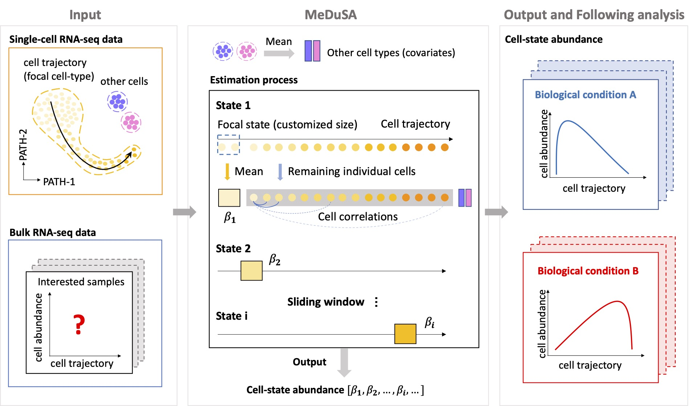

## MeDuSA

### Introductions
MeDuSA is a cellular deconvolution method that utilizes scRNA-seq data as a reference to estimate `cell-state abundance along a one-dimensional trajectory` in bulk RNA-seq data. The method employs a linear mixed model (LMM), which fits a cell state in question (either a single cell or the mean of multiple cells) as a fixed effect, while the remaining individual cells of the same cell type as random effects, accounting for the correlations between cells. This innovative model improves deconvolution accuracy by allowing each cell to have a specific weight on bulk gene expression, resulting in a better capture of variance in bulk gene expression. Furthermore, the LMM ameliorates the collinearity problem between cells at the focal state (fitted as a fixed effect) and those at adjacent states (fitted as random effects). 

### Installations
* [here](https://leonsong1995.github.io/MeDuSA/documentation/02_installation.html)

### Example analysis
* [hPSCs](https://leonsong1995.github.io/MeDuSA/documentation/05_hPSC_Example.html)
* [monocytes](https://leonsong1995.github.io/MeDuSA/documentation/04_Mon_Example.html)

### Extension
MeDuSA now also supports cell-state deconvolution for annotated cell states (cell types). Please check the link below: 
https://github.com/LeonSong1995/MeDuSAJ. 
Tutorial on how to use MeDuSAJ will be available later.

